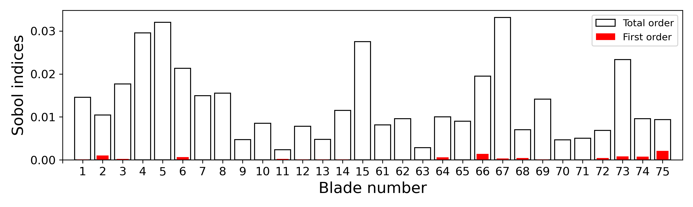

# Create different types of plots using **matplotlib**

## 1. Use [Embed_multiple_plots_within_a_plot.py](./Embed_multiple_plots_within_a_plot.py) to create the plot below 

## 2. Use [Insets_blended.py](./Insets_blended.py) to create the plot below 

## 3. Use [barplot.py](./barplot.py) to create the plot below 

## 4. Use [plotMCS.py](./plotMCS.py) to create the plot below 

## 5. Use [plotMIS_KWRCinit.py](./plotMIPS_KWRCinit.py) to create plots like the one below (data file not included) 

## 6. Use [plotstdconvergence.py](./plotstdconvergence.py) to create the plot below 

## 7. Use [plotAniformFibreStress.py](./PlotAniformFibreStress.py) to create the three dimensional scatter plot below 